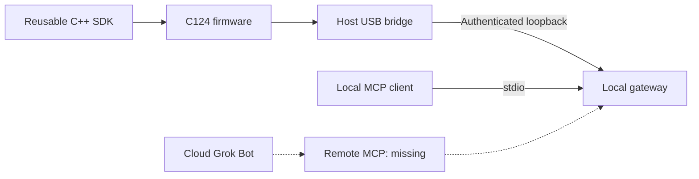

# Grok Gadgets ESP32 SDK

Build an ESP32 gadget for Grok with a reusable C++ library. **M5Stack AtomS3 Lite C124** is the first USB example. Other boards need configuration and separate verification.

Documentation uses an [ASD-STE100-inspired writing guide](https://github.com/adidshaft/grok-gadgets/blob/main/docs/contributing/writing-guide.md). Formal compliance is not claimed.

**Experimental alpha.** Software tests and ESP32-S3 compilation pass. Physical hardware, actual Grok invocation and mobile behavior remain unverified.

You can build and contribute without a board or Grok account. The example uses standalone Arduino firmware. It is not an ESPHome integration.



Firmware uses the SDK. The USB bridge and gateway run on the same computer.
Local development and simulation need no public hosting. The builder operates the gateway.
Grok/xAI hosts Grok Bot.

The gateway has local stdio MCP and an authenticated loopback device port.
It has no remote HTTPS or OAuth MCP service. Do not expose the device port through a tunnel.
Cloud access needs a publicly reachable, authenticated HTTPS MCP route.
`HARD-GROK-REMOTE-001` tracks this missing service and its security work.
See the [hosting FAQ](https://github.com/adidshaft/grok-gadgets/blob/main/docs/getting-started/hosting.md)
for tunnel ownership and proposed customer-hosted or maker-hosted product options.

Compilation checks the build. It does not prove physical LED, button or USB operation.

## Start without hardware

Clone [adidshaft/grok-gadgets-esp32-sdk](https://github.com/adidshaft/grok-gadgets-esp32-sdk) and enter its root directory. A sibling repository is unnecessary for the following checks.

You need:

- Python 3.11 or later.
- Git.
- CMake 3.16 or later.
- A C++14 compiler.
- Internet access for the first dependency and toolchain installation.

The recorded build host is macOS arm64. Linux USB permissions, Windows installation and Intel Mac installation remain unverified.

For physical tests, use C124 and a USB-C **data** cable. ATOM Lite and AtomS3 with a display are different boards.

```sh
python3 -m venv .venv
.venv/bin/pip install -r requirements.lock
.venv/bin/pio pkg install
sh tools/check.sh
.venv/bin/python tools/check_contract.py
.venv/bin/pio run -e atoms3-lite-usb
```

Expected results:

- CTest reports **3/3** host suites passed.
- The contract checker accepts canonical and generated frames.
- PlatformIO reports **SUCCESS**.

Build output is `.pio/build/atoms3-lite-usb/firmware.bin`. The same directory contains ELF, bootloader and partition files.

Host tests compile the example loop with simulated board and serial APIs. These commands do not flash a board.

| Next step | Guide |
| --- | --- |
| Build, inspect hashes, and prepare a separate hardware test | [Build, flash and recovery](docs/build-flash.md) |
| Add your own command and state writer | [Reusable library and counter example](docs/sdk.md) |
| Understand retries, events and reconnects | [Protocol and recovery](docs/protocol-recovery.md) |
| Check exact board/pin provenance | [Manufacturer source record](docs/board-sources.md) |
| Review what passed and what remains open | [Verification](docs/verification.md) |
| Help with software, docs or hardware evidence | [Contributing](CONTRIBUTING.md) |

## What is tested

| Path | Evidence | Remaining gate |
| --- | --- | --- |
| Custom capabilities, strict RGB inputs, bounded retries | C++ host tests against pinned ArduinoJson | Your gadget's hardware handler |
| Canonical protocol 0.1.0 | Pinned fixtures and frame-size validation | Coordinated changes with gateway/SDK consumers |
| C124 USB consumer | Host loop plus simulated USB/gateway integration | Physical enumeration, flashing, LED/button observation |
| ESP32-S3 firmware | Pinned C124 build | Physical board acceptance |
| Wi-Fi and existing Grok Bot connection | Explicit roadmap dependencies | Authenticated reachable transport/provisioning; native invocation evidence |

The canonical [gateway contract](https://github.com/adidshaft/grok-gadgets-gateway/tree/main/protocol/0.1.0) is consumed through local [protocol pins](protocol/source.json). The [Linux SDK](https://github.com/adidshaft/grok-gadgets-linux-sdk) targets computer applications; this SDK targets firmware on a microcontroller. [Home Assistant](https://github.com/adidshaft/grok-gadgets-home-assistant) uses its upstream MCP server directly. The source repositories document each component; no hosted device service is provided.

For common build/connection errors see [Support](SUPPORT.md). Report public defects through the [issue chooser](https://github.com/adidshaft/grok-gadgets-esp32-sdk/issues/new/choose). Keep credentials private and use [Security](SECURITY.md) for vulnerabilities.

Original code is [Apache-2.0](LICENSE); [NOTICE](NOTICE) and [dependency licenses](docs/dependencies.md) explain attribution and firmware redistribution review. Firmware binaries remain unpublished pending that review. This independent project is unaffiliated with xAI and M5Stack. Community discussion is at [r/GrokGadgets](https://www.reddit.com/r/GrokGadgets/), under the hub's [conduct policy](https://github.com/adidshaft/grok-gadgets/blob/main/CODE_OF_CONDUCT.md).

## History note

Pre-publication commit dates were reconstructed across 29 September–5 October 2026 at the owner’s request. Verification records retain their actual execution dates. See the [history and privacy record](https://github.com/adidshaft/grok-gadgets/blob/main/docs/verification/publication-sanitization.md).
