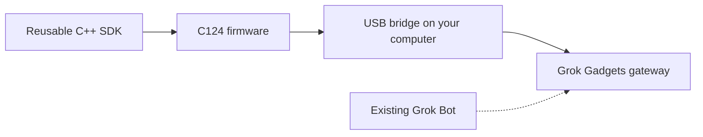

# Grok Gadgets ESP32 SDK

Build an ESP32 gadget for Grok with a reusable C++ capability library and an **M5Stack AtomS3 Lite C124** USB example.

**Experimental alpha — software tests and ESP32-S3 compilation pass; physical hardware, native Grok invocation and mobile behavior remain unverified.** You can build and contribute without a board or Grok account. This is standalone Arduino firmware, not an ESPHome integration.



The firmware uses the SDK, a computer bridges USB to the local gateway, and the Grok connection is a separately pending authenticated route. Compilation checks the firmware build; it does not demonstrate the LED, button or USB cable working physically.

## Start without hardware

Get this repository's source and enter its root directory. The publication destination is [adidshaft/grok-gadgets-esp32-sdk](https://github.com/adidshaft/grok-gadgets-esp32-sdk); until publication, use the reviewed source archive supplied with the local candidate. A sibling repository is unnecessary for the following checks.

Requirements: Python 3.11+, Git, CMake 3.16+, a C++14 compiler, and internet access for the first pinned dependency/toolchain installation. The recorded build host is macOS arm64. Linux USB permissions, Windows and Intel Mac installation are not verified here. The physical example additionally needs the exact C124 board and a USB-C **data** cable; ATOM Lite and display-equipped AtomS3 are different boards.

```sh
python3 -m venv .venv
.venv/bin/pip install -r requirements.lock
.venv/bin/pio pkg install
sh tools/check.sh
.venv/bin/python tools/check_contract.py
.venv/bin/pio run -e atoms3-lite-usb
```

Expected results: CTest reports **3/3** host suites passed; the contract checker reports valid canonical and generated frames; PlatformIO reports **SUCCESS**. The firmware output is `.pio/build/atoms3-lite-usb/firmware.bin`, alongside the ELF, bootloader and partition files. Host suites include the real example loop compiled with simulated board/serial APIs; no board is flashed by these commands.

| Next step | Guide |
| --- | --- |
| Build, inspect hashes, and prepare a separate hardware test | [Build, flash and recovery](docs/build-flash.md) |
| Add your own command and state writer | [Reusable library and counter example](docs/sdk.md) |
| Understand retries, events and reconnects | [Protocol and recovery](docs/protocol-recovery.md) |
| Check exact board/pin provenance | [Manufacturer source record](docs/board-sources.md) |
| Review what passed and what remains open | [Verification](docs/verification.md) |
| Help with software, docs or hardware evidence | [Contributing](CONTRIBUTING.md) |

## What is tested

| Path | Evidence | Remaining gate |
| --- | --- | --- |
| Custom capabilities, strict RGB inputs, bounded retries | C++ host tests against pinned ArduinoJson | Your gadget's hardware handler |
| Canonical protocol 0.1.0 | Pinned fixtures and frame-size validation | Coordinated changes with gateway/SDK consumers |
| C124 USB consumer | Host loop plus simulated USB/gateway integration | Physical enumeration, flashing, LED/button observation |
| ESP32-S3 firmware | Pinned C124 build | Physical board acceptance |
| Wi-Fi and existing Grok Bot connection | Explicit roadmap dependencies | Authenticated reachable transport/provisioning; native invocation evidence |

The canonical [gateway contract](https://github.com/adidshaft/grok-gadgets-gateway/tree/main/protocol/0.1.0) is consumed through local [protocol pins](protocol/source.json). The [Linux SDK](https://github.com/adidshaft/grok-gadgets-linux-sdk) targets computer applications; this SDK targets firmware on a microcontroller. [Home Assistant](https://github.com/adidshaft/grok-gadgets-home-assistant) uses its upstream MCP server directly. These links identify publication destinations; they do not claim activated services.

For common build/connection errors see [Support](SUPPORT.md). Report public defects through the [issue chooser](https://github.com/adidshaft/grok-gadgets-esp32-sdk/issues/new/choose) after activation, or use the [local ledger](planning/issues.json) during preparation. Keep credentials private and use [Security](SECURITY.md) for vulnerabilities.

Original code is [Apache-2.0](LICENSE); [NOTICE](NOTICE) and [dependency licenses](docs/dependencies.md) explain attribution and firmware redistribution review. Firmware binaries remain unpublished pending that review. This independent project is unaffiliated with xAI and M5Stack. Community discussion is at [r/GrokGadgets](https://www.reddit.com/r/GrokGadgets/), under the hub's [conduct policy](https://github.com/adidshaft/grok-gadgets/blob/main/CODE_OF_CONDUCT.md).

## History note

Pre-publication commit dates were reconstructed across 29 September–5 October 2026 at the owner’s request. Verification records retain their actual execution dates. See the [history and privacy record](https://github.com/adidshaft/grok-gadgets/blob/main/docs/verification/publication-sanitization.md).
